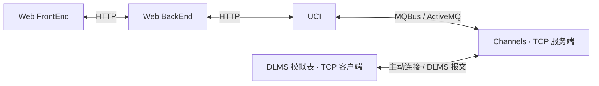

# HES 智能电表信息采集系统

HES（Head-end System）面向电表档案管理、随时抄表和系统日志查询，采用前后端分离、独立服务与消息队列架构，通过自研 DLMS/COSEM 协议组件和模拟表验证完整采集链路。

**当前状态：前端骨架已建立，业务实现待开始。** 仓库包含原始 HTML 指导文档、SDD 规范、开发任务、项目技能与 frontend/ 工程；后端服务及数据库初始化脚本尚未实现。实施进度以 [任务清单](specs/task.md) 为准。

## 计划实现的功能

| 功能 | 交付范围 |
| --- | --- |
| 电表档案管理 | 分页与条件筛选、详情、增删改、Excel/CSV 导入导出及错误明细 |
| 随时抄表 | 多电表、多数据项选择，按表拆分任务，同任务内串行、跨表并行，实时展示结果 |
| 系统日志 | 基于文件和 Lucene 的日志查询、时间/级别/关键词筛选、详情与导出 |
| 模拟与验证 | 多模拟表接入、登录与心跳、LLS 认证、GET 响应、断线重连及端到端测试 |

## 系统架构



| 模块 | 职责 |
| --- | --- |
| Web FrontEnd | 档案、随时抄表、日志页面与交互 |
| Web BackEnd | 对外 API、档案管理、UCI 调用和日志查询 |
| UCI | 加载档案与数据项，拆分调度任务，GET 报文组包/解包 |
| Channels | TCP 连接与身份映射、登录/心跳、AARQ/AARE 应用连接及报文转发 |
| Common | 自研 MQBus、Protocol、Logger、LoggerQuery，供服务复用 |
| DLMS 模拟表 | 主动连接 Channels，验证 LLS 密码并返回模拟数据 |

Web BackEnd、UCI、Channels、模拟表分别部署为独立 Spring Boot 进程，Common 作为组件依赖。任务队列为 `HES.Task.Channels`，结果队列为 `HES.Result.UCI`。完整设计见 [design.md](specs/design.md)。

## 技术栈

以下结合原始文档与当前 [AGENTS.md](AGENTS.md) 中的选型；表内环境记录不代表已完成依赖兼容性验证。

| 层次 | 选型 | 说明 |
| --- | --- | --- |
| 前端 | Vue 3、Tailwind、Element Plus、TS、Pinia、Vue Router、Axios 1.x | 精确依赖版本须在工程创建时锁定 |
| 前端工具 | Vite、ESLint | Vite 已选定；ESLint 配置待定 |
| Node.js | AGENTS.md 记录当前使用 24.10.0 | 原 HTML 为 16/18；与构建工具的兼容性需验证 |
| 后端 | Java 8、Spring Boot、Maven 3.x | Spring Boot 版本须兼容 Java 8 |
| 数据访问 | MyBatis、MySQL 5.7 或 8.0 | 数据库版本待选；UCI 数据访问实现可选 |
| 通信 | ActiveMQ 5.x、JMS、自研 MQBus/Protocol | Channels 推荐使用 Netty |
| 日志 | Lucene、文件存储 | 自研 Logger/LoggerQuery，Lucene 版本须兼容 Java 8 |
| 部署 | Windows Server 2016+、可执行 JAR、前端静态资源 | 静态 Web 服务器、连接池及 API 文档工具待选 |

AGENTS.md 中 UI/状态/路由组件的 `latest` 是选型意向，尚非可复现的精确版本；后续应由工程配置和锁文件固定。历史 HTML 与当前选型的差异需在设计和任务中同步记录。

## 仓库结构

```text
.
├── README.md                    # 项目介绍与阅读入口
├── AGENTS.md                    # 协作规则、技术栈与验收约束
├── docs/                        # 00–11 原始 HTML，以及 12 前端开发与审查规范
├── specs/
│   ├── proposal.md              # 为什么做、改动范围与交付目标
│   ├── design.md                # 架构、技术决策、风险与取舍
│   ├── task.md                  # 实施任务、依赖与验证条件
│   ├── spec.md                  # 需求 ID、业务规则和验收场景
│   └── reference.md             # 来源索引、冲突和待决事项
└── skills/
    ├── hes-spec-workflow/       # 规范维护技能及 HTML 提取脚本
    ├── hes-integration-review/  # 联调验收技能及检查表
    └── hes-frontend-cr/         # 引用前端规范进行代码审查
```

## 开始参与

1. 阅读 [AGENTS.md](AGENTS.md)，了解项目约束和技术栈。
2. 阅读 [提案](specs/proposal.md)、[业务规范](specs/spec.md) 和 [设计](specs/design.md)，确定当前改动的范围与需求 ID。
3. 查看 [待决事项](specs/reference.md)，优先明确相关协议格式、实时结果接口、消息与重试语义。
4. 从 [任务清单](specs/task.md) 选择任务，完成实现、验证并记录证据后再勾选。

原始文档的阅读入口为 [项目任务书](docs/00-项目任务书.html) 与 [项目概述](docs/01-项目概述.html)，全部文档链接见 [来源索引](specs/reference.md)。原文冲突按任务书、概述、架构、其他指导的顺序处理；不要把推测写成既定要求。

目前可直接使用的辅助脚本是 HTML 文本提取器，在仓库根目录运行，需 Python 3，仅使用标准库：

```powershell
# 提取一份文档
python skills/hes-spec-workflow/scripts/extract_html.py docs/05-API接口规范.html

# 提取 docs 下全部 HTML
python skills/hes-spec-workflow/scripts/extract_html.py docs
```

脚本只读取本地 HTML 并输出文本，不启动业务服务。实际构建与启动命令将在工程骨架完成后，根据 `pom.xml`、`package.json` 和部署配置补充。

## 开发与验收

功能/迭代规范使用“一需求一目录”，首个迭代为 [最小前端初始化](specs/000-frontend-init-feature/spec.md)。每份规范明确范围、验证方式和完成条件；现有根部规范作为项目背景保留。使用 [spec 自动更新与生成](skills/spec-auto-update/SKILL.md) 创建或更新。

采用 SDD（规范驱动开发）：先明确 proposal 中的目的与范围，再维护 spec 的行为场景、design 的实现决策和 task 的执行清单。借鉴 OpenSpec 的分层方式，当前没有配置 OpenSpec CLI。

| 阶段 | 主要交付 |
| --- | --- |
| Phase 1 | 契约与设计、工程骨架、数据库初始化、四个 Common 组件 |
| Phase 2 | 电表档案、UCI 调度、Channels、模拟表、实时抄表页面及完整链路 |
| Phase 3 | 日志查询与导出、测试报告、Windows 部署说明和最终验收 |

实施时保留以下关键约束：

- GET 前完成 LLS 应用连接认证；心跳每 3 分钟发送，超过 9 分钟未收到则离线并清理连接。
- 电表地址唯一；数据项以 `OBIS_classId_attributeId` 唯一，不能仅用 OBIS 区分；启用状态与在线状态分开。
- API 遵循 `POST /api/v1/...` 与统一 JSON 返回；日志采用文件/Lucene 存储，报告中不输出认证密码。
- 验证正常抄读和认证失败、断连、超时、重复/迟到响应等场景；仅共享编解码器互测不足以证明标准兼容。
- 核心组件和核心服务单元测试覆盖率至少 60%；最终提供四服务运行与完整采集链路的实际证据。模拟表成功抄读与系统运行联调属于任务书一票否决项。

规范维护可读取 [hes-spec-workflow](skills/hes-spec-workflow/SKILL.md)，联调验收可读取 [hes-integration-review](skills/hes-integration-review/SKILL.md)。仓库 `skills/` 需显式读取，不假定已被工具自动发现。

前端开发遵循 [前端代码开发与审查规范](skills/hes-frontend-cr/references/frontend-cr.md)。进行前端 CR 时读取 [hes-frontend-cr](skills/hes-frontend-cr/SKILL.md)，按规范输出有代码位置、触发条件和影响依据的发现。所有技能描述以“当……时，……”明确触发场景。
## 前端快速启动

最小前端工程位于 [frontend/](frontend/README.md)。使用 Node 24.10.0 / npm 11.6.1，执行 `cd frontend`、`npm ci`、`npm run dev`，访问 http://127.0.0.1:5173。
当前仅工程首页，业务能力仍待实现；验收见 [初始化规范](specs/000-frontend-init-feature/spec.md)。
